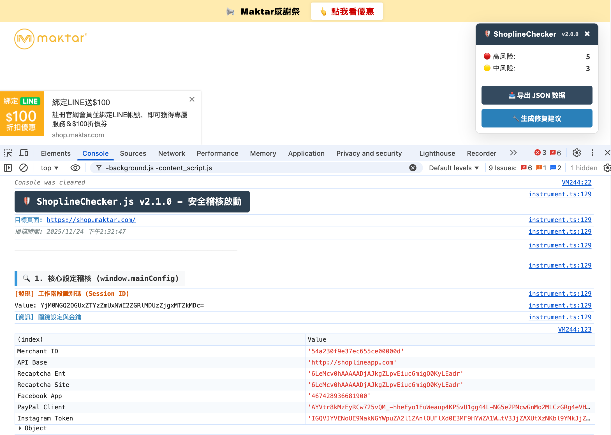

# ShoplineChecker.js

> **Shopline 店舖前端數據外洩掃描與安全隱私稽核工具**  
> Frontend Data Exposure Scanner, Safety & Privacy Audit Tool for Shopline Stores.

**ShoplineChecker.js** 是一個輕量級的瀏覽器端 JavaScript 腳本，專為 Shopline 商家、開發者及資安研究人員設計。它能快速掃描店舖前端頁面，識別潛在的敏感數據外洩（如 Session ID、使用者 PII、訂單金額）、隱私合規風險（Pixel 數據）及安全設定缺失（CSP/XFO），並自動產生修復建議報告。

## ✨ 功能特性 (Features)

*   **🕵️ 深度設定稽核**: 深入分析 `window.mainConfig`，識別 Session ID、API Key、Access Token 等敏感設定暴露。
*   **🛍️ 交易數據嗅探**: 自動檢測訂單成功頁 (`OrderData`)、購物車 (`CartData`) 及 LINE Points 廣告佇列，確認是否暴露了完整的訂單金額、客戶 ID 或庫存策略。
*   **🍪 隱私合規檢測**: 掃描 Facebook/TikTok/Criteo Pixel 佇列，檢測是否違規傳輸雜湊 (Hash) 後的使用者 PII 數據 (Email/Phone)。
*   **💉 框架注入檢測**: 偵測是否可透過 `AngularJS` 注入器 (Injector) 劫持 `$rootScope`，進而存取全域業務數據。
*   **🔐 本地儲存掃描**: 檢查 `localStorage` 和 `sessionStorage` 中是否包含 Token、Auth、Secret 等敏感關鍵字。
*   **🛡️ 網路安全檢查**: 自動檢測 CSRF Token 暴露、URL 參數 Token 傳輸、以及 `X-Frame-Options` / `CSP` 安全標頭的設定狀態。
*   **📄 自動報告產生**:
    *   **匯出 JSON**: 獲取原始掃描數據快照。
    *   **產生修復建議**: 自動產生 Markdown 格式的技術文件，包含具體的漏洞 ID、風險描述及修復程式碼建議。

## 🚀 使用方法 (Usage)

無需安裝任何瀏覽器外掛 (Plugin)，只需瀏覽器即可使用。

1.  打開任意 **Shopline 店舖** 的頁面（建議在訂單成功頁、購物車頁或會員中心頁進行測試）。
2.  打開瀏覽器 **開發者工具** (DevTools):
    *   Windows/Linux: 按 `F12` 或 `Ctrl + Shift + I`
    *   Mac: 按 `Cmd + Option + I`
3.  切換到 **控制台 (Console)** 分頁。
4.  複製 [shoplinechecker.js](shoplinechecker.js) 的全部程式碼，貼上到控制台中並按 **Enter** 鍵執行。
5.  **查看結果**:
    *   控制台將直接印出高亮的分級風險報告與詳細數據表格。
    *   頁面右下角會出現操作面板，點擊 **[🔧 產生修復建議]** 即可下載詳細報告。

## 📊 風險等級說明 (Risk Levels)

工具將發現的問題分為三個等級：

*   🔴 **HIGH (高風險)**: 必須立即修復。例如：Session ID 暴露（導致帳戶劫持）、未經同意的 PII 傳輸、缺失 CSP、URL 傳輸 Token。
*   🟡 **MEDIUM (中風險)**: 建議儘快改進。例如：購物車數據全域暴露、LocalStorage 儲存 Token、社群 Token 暴露。
*   🟢 **LOW (低風險)**: 最佳實踐建議。例如：公開的 Merchant ID、非敏感的設定暴露。

## ⚠️ 免責聲明 (Disclaimer)

1.  **授權原則**: 本工具僅限用於您**擁有合法權限**（如自有店舖或獲得明確書面授權）的目標網站進行安全自查。
2.  **禁止非法用途**: 嚴禁將本工具用於任何未經授權的滲透測試、攻擊行為或批次數據採集。
3.  **責任界定**: 開發者不對因使用本工具產生的任何法律後果、數據外洩或直接/間接損失承擔責任。使用本工具即代表您同意自行承擔所有風險。
4.  **合規提示**: 掃描結果僅供技術參考，不構成法律合規意見（如 GDPR/CCPA 合規性請諮詢法務專業人士）。

## 🤝 貢獻 (Contributing)

歡迎提交 Issue 反饋 Bug 或提交 Pull Request 貢獻新功能！

## 📄 授權 (License)

本專案基於 [MIT License](LICENSE) 開源。
